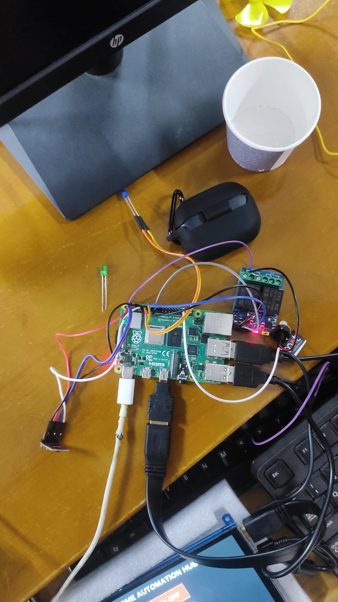

# 🐛 AI Pest Insect Detection & Smart Control System (Edge AI + IoT)

An **Edge AI + IoT project** that detects pest insects in real-time using **YOLOv8** running on a **Raspberry Pi**, and automatically controls devices like grow lights and cooling fans using relays.

This project demonstrates real-world integration of:

* Computer Vision
* Edge AI
* IoT Automation
* Smart Agriculture
* Embedded Systems

---

# 📸 Hardware Prototype

### Raspberry Pi System Setup



---

# 🚀 Features

• Real-time insect detection using YOLOv8
• Edge AI inference on Raspberry Pi
• Automatic buzzer alert when pests detected
• Smart control of grow lights
• Cooling fan automation
• Gesture control using APDS-9960 sensor
• Custom dataset labeled with Label Studio
• Low-power AI edge device

---

# 🧠 System Architecture

```
Pi Camera
    │
    ▼
YOLOv8 Insect Detection Model
    │
    ├──► Buzzer Alert
    │
    ▼
Raspberry Pi Controller
    ▲
    │
Gesture Sensor (APDS-9960)
    │
    ▼
Relay Module (2 Channel)
    │          │
    ▼          ▼
Grow Light    Cooling Fan
```

---

# 📊 AI Training Pipeline

```
Image Collection
      │
      ▼
Label Studio Annotation
      │
      ▼
YOLOv8 Model Training
      │
      ▼
Export best.pt
      │
      ▼
Deploy to Raspberry Pi
```

---

# 🧰 Hardware Components

* Raspberry Pi 4
* Pi Camera Module
* APDS-9960 Gesture Sensor
* 2 Channel Relay Module
* Buzzer
* LED Grow Lights
* Cooling Fan
* Jumper Wires
* Power Supply

---

# 💻 Software Stack

Python
YOLOv8 (Ultralytics)
OpenCV
RPi.GPIO
Label Studio
Linux (Raspberry Pi OS)

---

# 📁 Project Structure

```
ai-pest-insect-detection-edge-ai-iot
│
├── README.md
├── requirements.txt
│
├── images
│   ├── hardware_setup.jpg
│   ├── relay_module.jpg
│   └── prototype.jpg
│
├── dataset
│   ├── images
│   └── labels
│
├── model
│   └── best.pt
│
├── src
│   ├── detect.py
│   ├── relay_control.py
│   ├── gesture_control.py
│   ├── buzzer_alert.py
│   └── config.py
```

---

# ⚙️ Installation

## 1. Clone Repository

```bash
git clone https://github.com/abdullaabdulraoof/ai-pest-insect-detection-edge-ai-iot.git
cd ai-pest-insect-detection-edge-ai-iot
```

---

## 2. Install Dependencies

```bash
pip install -r requirements.txt
```

---

## 3. Run AI Detection System

```bash
python src/detect.py
```

---

# 🧪 Example Detection Logic

```python
if insect_detected:
    buzzer_on()
    fan_on()
else:
    buzzer_off()
    fan_off()
```

This allows the system to automatically respond when pests appear.

---

# 📈 Results

Model Accuracy: **~90%+ (custom dataset)**
Edge Inference Speed: **15–20 FPS on Raspberry Pi**
Detection Range: **30–60 cm**

---

# 🌍 Real World Applications

Smart Farming
Greenhouse Monitoring
Automated Pest Control
Agriculture AI Systems
IoT Edge AI Deployments

---

# 🔮 Future Improvements

Mobile App Monitoring
Cloud Dashboard
Automatic Pesticide Spray System
Multi-Camera AI Detection
Edge AI Optimization (TensorRT)

---

# 👨‍💻 Author

**Abdulla Abdul Raoof**

AI • Computer Vision • Edge AI • IoT

GitHub:
https://github.com/abdullaabdulraoof

---

# ⭐ If you like this project

Give it a star on GitHub to support the project!
